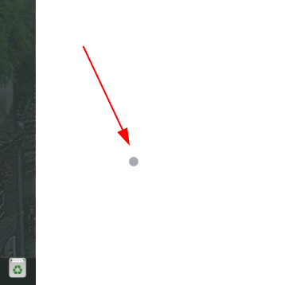
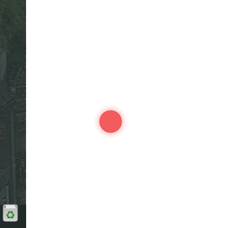
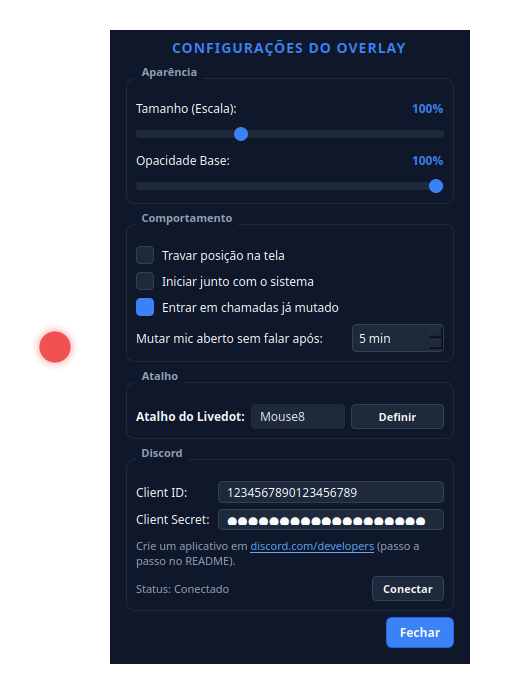
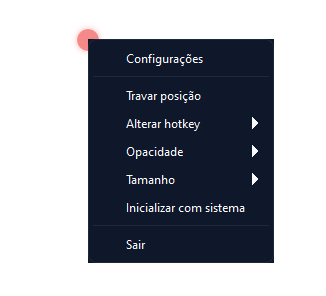

# LiveDot

Um pontinho que fica no canto da tela e mostra se o seu microfone do Discord está **aberto** ou **fechado**. Clique nele, ou use um atalho, para ligar e desligar o microfone sem precisar abrir o Discord.

| Microfone fechado | Microfone aberto |
|---|---|
|  |  |

- **Ponto escuro e pequeno:** microfone fechado. Discreto, quase some.
- **Ponto vermelho "respirando":** microfone aberto. Difícil de não notar.
- **Ponto escuro com um segundo anel:** você está ensurdecido.
- **Pontinho cinza bem fraco:** você não está em nenhuma chamada. Ninguém te ouve, então o estado do microfone fica de fora.
- **Anel cinza vazado:** o LiveDot não está conectado ao Discord.
- **Bolinha azul ao lado do ponto:** chegou mensagem desde a última vez que você olhou o Discord. Cheia para mensagem direta ou menção a você, só o contorno para o resto.

O ponto mostra sempre o estado real: se você mutar pelo próprio Discord, ele acompanha. O vermelho é só para "microfone aberto numa chamada"; nenhum outro aviso usa essa cor.

---

## Começando

### 1. Instale

**Windows:** baixe o `livedot.exe` na página de [Releases](https://github.com/kahd0/livedot/releases) e abra. Não precisa instalar nada.

**Linux:**

```bash
git clone https://github.com/kahd0/livedot.git
cd livedot
python3 -m venv venv
venv/bin/pip install -r requirements.txt
./livedot.sh
```

Precisa de Python 3.10 ou mais novo e de uma sessão X11.

### 2. Crie um app no Discord

O Discord só deixa um programa mexer no seu microfone se ele estiver registrado. Você faz isso uma vez só, em uns 5 minutos:

1. Abra o [Portal de Desenvolvedores do Discord](https://discord.com/developers/applications) e clique em **New Application**. Dê um nome, por exemplo `LiveDot`.
2. No menu **OAuth2**:
   - copie o **Client ID**;
   - clique em **Reset Secret** (redefinir) e copie o **Client Secret**. Ele só aparece uma vez;
   - em **Redirects** (redirecionamentos), adicione `http://localhost` e salve.

### 3. Conecte

1. Clique com o botão direito no ponto e abra **Configurações**.
2. No grupo **Discord**, cole o Client ID e o Client Secret e clique em **Conectar**.
3. O Discord vai pedir permissão. Clique em **Autorizar**.



Pronto! O status muda para *Conectado* e, daqui para frente, o LiveDot conecta sozinho sempre que o Discord estiver aberto.

O secret fica guardado só no seu computador, no arquivo de configuração. Não compartilhe esse arquivo.

---

## No dia a dia

- **Clique** no ponto para abrir ou fechar o microfone.
- **Use o atalho** (padrão `Ctrl+Alt+M`) para fazer o mesmo de qualquer lugar, até dentro de um jogo em tela cheia:
  - **toque** para alternar, como um clique;
  - **segure** para inverter só enquanto segura: mutado, você fala enquanto segura; aberto, o atalho vira um botão de tosse.
- **Clique com o botão do meio** no ponto para ensurdecer ou voltar a ouvir.
- **Clique na bolinha azul** para abrir no Discord a conversa da última mensagem.
- **Arraste** o ponto para mudá-lo de lugar: segure um instante e arraste. Depois, marque **Travar posição** para não movê-lo sem querer.
- **Clique com o botão direito** para abrir o menu com o resto das opções.



| No menu | Para quê |
|---|---|
| **Configurações** | Tamanho, opacidade, proteções do microfone, atalho e conexão com o Discord. |
| **Travar posição** | Evita mover o ponto sem querer. |
| **Definir atalho** | Escolhe o atalho global. |
| **Opacidade** e **Tamanho** | Ajustes rápidos da aparência. |
| **Inicializar com sistema** | Abre o LiveDot junto com o computador. |
| **Sair** | Fecha o LiveDot. |

### Proteções do microfone

Ficam em **Configurações**, no grupo **Comportamento**:

- **Entrar em chamadas já mutado** *(ligado por padrão)*: ao entrar ou ser movido para um canal de voz, o LiveDot fecha o microfone na hora e pisca o ponto uma vez em amarelo.
- **Mutar mic aberto sem falar após** *(5 min por padrão)*: se o microfone ficar aberto numa chamada todo esse tempo sem transmitir nada, o LiveDot fecha e pisca três vezes. Use `nunca` para desligar. O Discord conta qualquer som que passe da sensibilidade do microfone como fala, então barulho alto também zera a contagem.

### Aviso de mensagens

A bolinha azul segue as suas configurações de notificação do Discord: só acende para o que o Discord te notificaria, então servidores silenciados ficam de fora. Ela aparece com um pulinho, fica parada, e pulsa de novo se passar 15 minutos sem você olhar.

- **Passe o mouse** sobre o ponto para ver quem mandou e onde. O texto da mensagem não aparece, para não vazar num compartilhamento de tela.
- Ela some sozinha quando a janela do Discord vem para frente. O Discord não avisa quando uma mensagem é lida, então olhar o Discord é o que conta.

**Dica de atalho:** um botão lateral do mouse (`Mouse8` ou `Mouse9`) é o jeito mais confortável de alternar o microfone. Também vale uma tecla junto com `Ctrl`, `Alt`, `Shift` ou `Super`, ou uma tecla de `F1` a `F24` sozinha.

---

## Algo deu errado?

Quando algo não está certo, o ponto vira um anel cinza e o motivo aparece no topo do menu do botão direito, com um ⚠.

| Mensagem | O que fazer |
|---|---|
| *Discord fechado* | Abra o Discord. O LiveDot reconecta sozinho em poucos segundos. |
| *Discord não configurado* | Siga os passos [2](#2-crie-um-app-no-discord) e [3](#3-conecte). |
| *Autorização negada* ou *necessária* | Em Configurações, clique em **Conectar** e aceite no Discord. |
| *Invalid Client ID* | Confira o Client ID. |
| *Falha ao obter acesso* | Confira o Client Secret. Se você gerou um novo no portal, cole o novo. Se a mensagem citar `redirect_uri`, adicione `http://localhost` em **Redirects**. |
| *Atalho já usado por outro programa* | Escolha outra combinação em **Definir atalho**. |

**Não acha o ponto?** Abra o LiveDot de novo. O ponto que já está aberto pisca com um anel amarelo, e volta para a tela principal se estiver fora da área visível.

---

## Bom saber

- Abrir o microfone pelo ponto ou pelo atalho também tira o ensurdecer, como o botão do próprio Discord.
- O acesso ao Discord se renova sozinho. A autorização só é pedida de novo se você revogá-la.
- Vindo da versão 2.0? Na primeira vez o Discord pede autorização de novo, porque o aviso de mensagens precisa de uma permissão a mais. Se você recusar, o resto continua funcionando, só sem a bolinha.
- Cada pessoa precisa criar o próprio app no portal: o Discord não deixa usar o app de outra pessoa.
- No Linux, o atalho global precisa de uma sessão X11. Em Wayland puro, ele não funciona.
- Vindo da versão 1? Pode apagar o atalho `Ctrl+Shift+F12` das configurações do Discord: ele não é mais usado.

| Onde fica | Linux | Windows |
|---|---|---|
| Configuração | `~/.config/livedot/config.json` | `%APPDATA%\Livedot\config.json` |
| Log | `~/.config/livedot/logs/livedot.log` | `%APPDATA%\Livedot\logs\livedot.log` |
